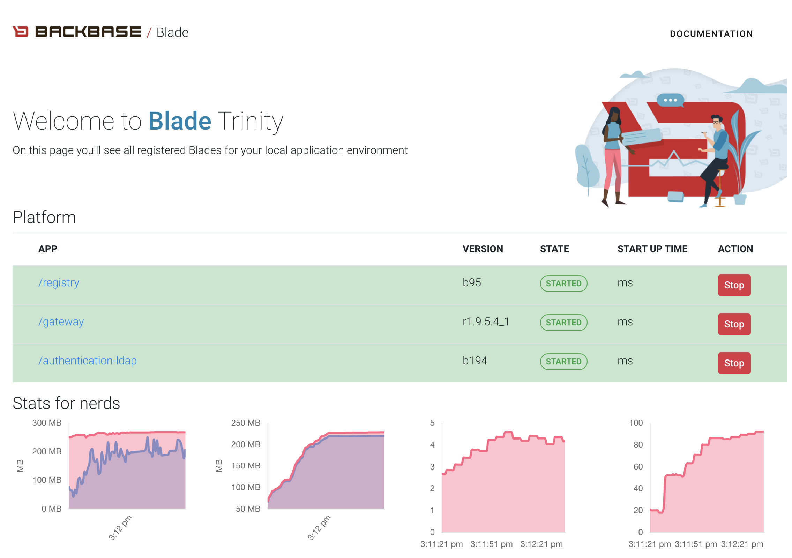

= blade-maven-plugin


[](https://sonarcloud.io/dashboard?id=com.backbase.oss%3Abackbase-openapi-tools)
[](https://maven-badges.herokuapp.com/maven-central/com.backbase.oss/blade)


The Backbase Local Application Development Environment (Blade) is a convenience plugin to
run WAR files in an eAddembedded Tomcat container.

It's specifically tailored to run multiple web applications in a single Tomcat where the startup order is important.

All dependencies of type WAR are automatically deployed inside Tomcat. The artifactId of each dependency is used as context path.

== What's new in Blade Trinity

Blade Trinity is the third installment of the `blade-maven-plugin` and comes with exiting new features!

=== New New Blade Console
Blade now comes with a revamped Blade Console that shows all running Blades on your local development environment.
Never again you have to plow through all your open tabs to find the correct Blade console. They are now all registered on the Master Blade

To specify the Blade Master simply configure the `<masterBladeAddress>` in the `<configuration>` section!

Every time a status changes of a Web App, this is sent to the Master Blade which uses a nifty Web Socket connection to the Blade Console to show you a real time overview of all your running Blades!

=== Maven Sub Module support
Blade is now smart enough to dig into Maven sub modules and load Web Applications from the sub modules!
In the new Start project templates, each war file is set up in their own Maven Submodule to allow Docker images to be built. To load a Web Application defined in the submodule, you just need to define the `<module>` attribute in the `<webApp` configuration to point to the submodule

=== Environment Variables Per Web App
You can now define system properties that are specific to the Web App! These environment variables are injected into the Web App context on startup just like you would define them in the Tomcat Context XML files.

=== Detect Spring Application Configuration
Application.yml files found in Maven Sub Modules are automatically added as a `spring.config.additional-location`
(`spring .config.location` for Spring Boot 1.x.x apps) environment variable saving you the effort of creating a
Tomcat Context location file. For Spring Boot 1.x.x apps, you need to set `<springBoot1App>` to `true` under `<webApp>`.

=== Enable dynamic application reloading
Catalina will monitor classes in /WEB-INF/classes/ and /WEB-INF/lib for changes and automatically reload the web application if a change is detected, if property `<enableApplicationReload>` is set to `true`. This feature is useful during application development, however comes with a certain performance cost.

== Usage

`blade-maven-plugin` is pretty simple to setup.

Specify the WAR files you want to run in Tomcat
[source,xml]
----
<dependencies>
    <dependency>
        <groupId>org.codehaus.cargo</groupId>
        <artifactId>simple-war</artifactId>
        <version>1.7.11</version>
        <type>war</type>
    </dependency>
</dependencies>
----

Add the `blade-maven-plugin` to the plugins section inside the project pom.xml containing the WAR files you would like to run in Tomcat:
[source,xml]
----
...
<plugin>
    <groupId>com.backbase.oss</groupId>
    <artifactId>blade-maven-plugin</artifactId>
    <version>${blade-maven-plugin.version}</version>
</plugin>
...
----

Configure System Properties

Add the system properties you would normally setup in the setenv.sh/setenv.bat.

[source,xml]
----
...
<plugin>
    <groupId>com.backbase.oss</groupId>
    <artifactId>blade-maven-plugin</artifactId>
    <version>${blade-maven-plugin.version}</version>
    <configuration>
        <systemProperties>
            <SYSTEM_PROPERTY_NAME>value</SYSTEM_PROPERTY_NAME>
        </systemProperties>
    </configuration>
<plugin>
...
----

Start Blade by executing:

`mvn blade:run`

== Open browser automatically with Blade Dashboard

When starting `blade-maven-plugin` the default browser opens the blade console application



This application can shows the startup status of your blade server in real time. Once all applications are started, you can stop and start already running applications by using the start and stop buttons

NOTE: Starting and stopping of applications can only be done after all applications, which are set to automatically started, are started.

The default browser does not open on headless systems. Set `<openBrowserOnStartup>` to `false` for turning this off permanently.

You can register your  other Blade servers by specifying the Blade Master address in the `configuration` section:

NOTE: The default masterBladeAddress is set to `http://localhost:8080`

[source,xml]
----
<plugin>
    <groupId>com.backbase.oss</groupId>
    <artifactId>blade-maven-plugin</artifactId>
    <version>${blade-maven-plugin.version}</version>
    <inherited>false</inherited>
    <configuration>
        <port>${port}</port>
        <detectAndConfigureSpringConfigLocation>true</detectAndConfigureSpringConfigLocation>
        <masterBladeAddress>http://localhost:8080</masterBladeAddress>
        <stages>
            <stage>
                <id>${artifactId}</id>
                <name>Stage Name</name>
                <multiThreaded>true</multiThreaded>
                <webApps>
                    <webApp>
                        <module>submodule-1</module>
                    </webApp>
                    <webApp>
                        <module>submodule-2</module>
                    </webApp>
                </webApps>
            </stage>
        </stages>
    </configuration>
</plugin>
----


== Deployment Stages

Many applications require a startup order such as a Service Registry. The start up order can be configured using `stages`.

[source,xml]
----
    <plugin>
        <groupId>com.backbase.oss</groupId>
        <artifactId>blade-maven-plugin</artifactId>
        <version>${blade-maven-plugin.version}</version>
        <configuration>
            <openBrowserOnStartup>true</openBrowserOnStartup>
            <port>8080</port>
            <systemProperties>
                ....
                <BACKBASE_ENVROLE>editorial</BACKBASE_ENVROLE>
                <BACKBASE_HOME>${project.basedir}/target/cx/</BACKBASE_HOME>

                <!-- Active MQ Configuration -->
                <SPRING_ACTIVEMQ_BROKER_URL>tcp://localhost:61616</SPRING_ACTIVEMQ_BROKER_URL>
                <SPRING_ACTIVEMQ_USER>admin</SPRING_ACTIVEMQ_USER>
                <SPRING_ACTIVEMQ_PASSWORD>admin</SPRING_ACTIVEMQ_PASSWORD>
                ....

            </systemProperties>
            <stages>
                <stage>
                    <id>infra</id>
                    <autoStart>true</autoStart>
                    <multiThreaded>false</multiThreaded>
                    <webApps>
                        <webApp>
                            <groupId>com.backbase.infra</groupId>
                            <artifactId>registry</artifactId>
                            <url>/registry</url>
                        </webApp>
                    </webApps>
                </stage>
                <stage>
                    <id>portal</id>
                    <autoStart>true</autoStart>
                    <multiThreaded>false</multiThreaded>
                    <webApps>
                        <webApp>
                            <groupId>com.backbase.cxp</groupId>
                            <artifactId>portal</artifactId>
                        </webApp>
                    </webApps>
                </stage>
            </stages>
        </configuration>
        <dependencies>
            <dependency>
                <groupId>mysql</groupId>
                <artifactId>mysql-connector-java</artifactId>
                <version>5.1.41</version>
            </dependency>
        </dependencies>
    </plugin>
----

The order of the stages is respected while starting up. THe next stage will only deploy if the previous stage is deployed.
Each `<stage>` can be configured with the following tags:

|===
| Tag   | Description
| `id`  | Unique identifier of the stage
| 'name' | Display name of the Stage. If emtpy, the ID will be used
| 'autoStart' | If set to `true` the Stage will start automatically on startup
| 'multiThreaded' | Applications in a Single stage are started at the same time. (Caution. Only use on environments with high number of CPU's)
| 'webApps' | A list of `<webApp>` elements for this stage.
|===

Each <webApp> can be configured with the following options

|===
| Tag   | Description
| `groupId`         | The Maven Group ID used for looking up the artifact from the artifact defined in the `<dependencies>` section
| `artifactId`      | The Maven Artifact ID used for looking up the artifact from the artifact defined in the `<dependencies>` section
| `version`         | The Maven Version used for looking up the artifact from the artifact defined in the `<dependencies>` section
| `name`            | The Display Name used to show in the Blade console
| `module`          | The Maven sub module that defines the WAR dependency or if the Maven module is a WAR project, it will load that WAR file into blade
| `url`             | URL shown in the Blade console pointing to the entry point of the application
| `docBase`         | If set, Tomcat will load the Web Application from the specified WAR file or expanded WAR directory and ignore the groupId and artifactId tags.  
| `contextPath`     | The Tomcat Context Path on which the WAR file will be deployed
| `contextFileLocation` | Location of the context file location. If empty, context file will be resolved from project structure as defined in this guide
| `privileged`  | Run on Tomcat Privileged mode. Privileged applications have access to other WAR applications
| `inheritClassloader` | Whether to inherit the Tomcat class loader and allow shared libraries between Maven process and your WAR.
| `springBoot1App` | Boolean to differentiate if it's a Spring Boot 1.x.x app. Default false.
|===

`blade-maven-plugin` expects context and spring configuration files in a specific directory.

[source]
----
${project.basedir}
    ├── config
    │   ├── backbase                        --> Available as ${backbase.config.dir}
    │   │   ├── gateway
    │   │   │   ├── application.yml
    │   │   │   └── logback.xml
    │   │   └── registry
    │   │       ├── application.yml
    │   │       └── logback.xml
    │   └── tomcat
    │       ├── ESAPI.properties
    │       ├── bin
    │       │   └── setenv.sh
    │       ├── conf
    │       │   ├── Catalina
    │       │   │   └── localhost           --> Tomcat Context File Path
    │       │   │       ├── gateway.xml
    │       │   │       └── registry.xml
    │       │   ├── server.xml
    │       │   └── tomcat-users.xml
    │       └── webApps
    │           └── manager
    │               └── META-INF
    │                   └── context.xml
    └── pom.xml
----

== System Properties
For your convenience, Blade injects the following system properties if not present:

=== backbase.config.dir

The backbase.config.dir property can be used inside the your Tomcat Context files to point to absolute directories without hardcoded values:
[source,xml]
----
<?xml version="1.0" encoding="UTF-8"?>
<Context useHttpOnly="false">

    <Environment name="spring.config.location"
                 value="${backbase.config.dir}/gateway/application.yml"
                 type="java.lang.String"
                 override="false"/>

</Context>
----


== Custom properties
You can also add custom properties to Tomcat by adding them in the `systemProperties` element inside `configuration`.

[source,xml]
----
...
<plugin>
    <groupId>com.backbase.oss</groupId>
    <artifactId>blade-maven-plugin</artifactId>
    <version>${blade-maven-plugin.version}</version>
    <configuration>
        <port>8080</port>
        <enableJolokia>true</enableJolokia>
        <systemProperties>
            <backbase.api.disableSecureExceptions>true!</backbase.api.disableSecureExceptions>
            <MESSAGING_PASSWORD>JWTEncKeyDontUseInProduction666!</MESSAGING_PASSWORD>
        </systemProperties>
    </configuration>
<plugin>
...
----

== Blade properties
[source]
----
connector.maxThreads=20 # Maximum number of request serving threads in each Tomcat
connector.maxThreads.dynamic=false # Whether to calculate maxThreads based on connector.maxThreads * number of services being deployed
connector.maxHttpHeaderSize=65000 # The Tomcat Connector maxHttpHeaderSize property
----

e.g. ```mvn blade:run -Dconnector.maxThreads=10 -Dconnector.maxThreads.dynamic=true```, max 10 request servings threads, scale request serving threads by the number of services in the Tomcat.

== Custom Tomcat Context Files

You can specify custom Tomcat context files for each war file.
By default it will search the `<artifactId>.xml` file inside `${project.basedir}/config/tomcat/conf/Catalina/localhost/`

In the Tomcat Context File you can set the JNDI values or environment properties specific for the WAR file.

[source,xml]
----
<?xml version="1.0" encoding="UTF-8"?>
<Context useHttpOnly="false">

    <Environment name="spring.config.location"
                 value="${backbase.config.dir}/gateway/application.yml"
                 type="java.lang.String"
                 override="false"/>

</Context>
----

You can override the location where Blade will look for the context file by specifying the `contextFileDir` property

[source,xml]
----
<plugin>
    <groupId>com.backbase.oss</groupId>
    <artifactId>blade-maven-plugin</artifactId>
    <version>${blade-maven-plugin.version}</version>
    <configuration>
        <contextFileDir>${contextFileDir}</contextFileDir>
    </configuration>
</plugin>
----

== How to load database drivers

Maven got you covered for this. Just add it to the dependencies of the plugin
[source,xml]
----
<plugin>
    <groupId>com.backbase.oss</groupId>
    <artifactId>blade-maven-plugin</artifactId>
    <version>${blade-maven-plugin.version}</version>
    <dependencies>
        <dependency>
            <groupId>mysql</groupId>
            <artifactId>mysql-connector-java</artifactId>
            <version>5.1.41</version>
        </dependency>
    </dependencies>
</plugin>
----

== How do I stop blade?

Just exist the process with Control/Cmd-C


== How do I limit memory consumption?

create a directory called .mvn inside ${project.basedir} . In that directory, create a file called `jvm.config`.
In the `jvm.config` file you can specify the JVM parameters:

----
-Xmx256m
----

== Do Androids Dream of Electric Sheep?

Not yet. Probably. Maybe yes.


